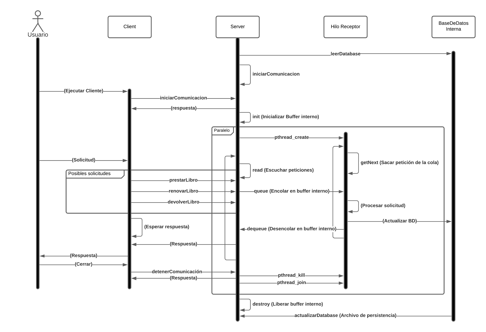
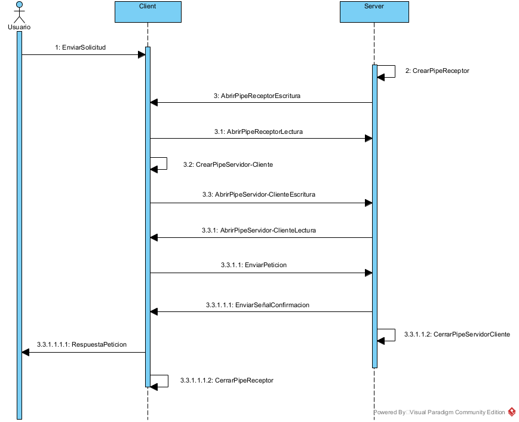

# Bibliotecas SOP
BibliotecasSOP es un sistema de gestión bibliotecario para Solicitar, Renovar o Devolver libros. Se compone de un único Servidor al cual múltiples Clientes pueden conectarse y procesas solicitudes

## Compilación
###### Ejecutables
Para compilar el programa sólo hace falta utilizar el comando 'make' en la carpeta padre 'bibliotecassop'
> make

Los ejecutables se encontrarán en la carpeta 'bin' y todos los archivos de prueba se copiarán a ese mismo directorio.

###### Documentación
Para crear la documentación de Doxygen puede correr el siguiente comando desde la carpeta padre:
> make docs

Los archivos HTML y LATEX se encuentran en la carpeta './docs/doxy', la página HTML puede verse abriendo el archivo 'Documentacion.html' dentro de la carpeta padre 'bibliotecassop'

###### Limpiar
Para eliminar todos los archivos generados por make (incluye binarios y documentación), puede correr el siguiente comando desde la carpeta padre:
> make clean

## Uso

### Servidor
El Servidor se encarga de leer y manipular la Base de Datos (BD) de los libros, los operaciones a realizar en la BD están dadas por las peticiones que hagan los Clientes al Servidor ([véase ¿Cómo se envían información entre Cliente y Servidor?](#¿cómo-se-envía-información-entre-cliente-y-servidor)), debe crear el Servidor antes que cualquier Cliente de la siguiente manera:

> Uso: ./server -p pipeServidor -f baseDeDatos -s archivoPersistencia

- el flag -f se utiliza para específicar el archivo de texto donde se almacena la base de datos de todos los libros ([veáse Base de datos](#base-de-datos))

- el flag -s se utiliza para específicar el archivo de texto donde se almacenarán los cambios realizados a la base de datos. ([veáse Base de datos](#base-de-datos))

### Cliente
El Cliente se encargará de recibir las peticiones a realizar y se las enviará al Servidor ([véase Servidor](#servidor)). 
Antes de que crear cualquier Cliente, debe haber un Servidor actualmente en ejecución y el nombre de su pipe (Cliente->Servidor) debe pasarse por parámetro al Cliente

> Uso: ./client [-i Archivo] -p pipeServidor 
> [-i archivo] es opcional!

Las peticiones pueden realizarse mediante un archivo de texto con el flag -i, si no se utiliza este flag se mostrará un menú ([veáse Archivo de peticiones](#archivo-de-peticiones))

Sólo se puede tener un único servidor pero múltiples clientes conectados al mismo.

## Archivos de texto
### Base de datos
Este archivo será leído por el Servidor, un ejemplo puede encontrarse en (./archivo_prueba/BD.txt)

Formato:
> Nombre del Libro,ISBN,ejemplares 
> NumeroDeEjemplar,[estado](#estado),fecha(dd/mm/yy)

##### Estado
Caractér que indica el estado
* D: Disponible
* P: Prestado
### Archivo de peticiones
Este archivo será leído por el Cliente y es opcional, si no se utiliza archivo el cliente mostrará un menú ([véase Cliente](#cliente)), un ejemplo de este archivo puede ser encontrado en (./archivo_prueba/PS.txt) y (./archivo_prueba/PS1.txt)

Formato:
>  [peticion](#peticion),Nombre del libro,ISBN

##### Peticion
Caractér que indica el tipo de petición
- P: Prestar
- D: Devolver
- R: Renovar

## ¿Cómo se envía información entre Cliente y Servidor?
### Pipes
La comunicación entre Clientes y Servidor se da mediante pipes nominales de la librería POSIX

* El Servidor tiene un único pipe de lectura mediante el cual todos los clientes envían sus peticiones (Cliente-> Servidor), el nombre de este pipe se da mediante parámetros en la creación del Servidor
  
* Cada cliente tiene su propio pipe de lectura mediante el cual el Servidor envía información al Cliente (Servidor-> Cliente) y el nombre se asigna de acuerdo al PID del proceso cliente "pipeCliente_PID"

Según lo anterior, existen múltiples pipes (Servidor-> Cliente) pero sólo un pipe(Cliente-> Servidor) y será el creador del pipe el encargado de borrarlo al finalizar ([véase Protocolo de comunicación](#protocolo-de-comunicación))

### Hilo receptor
El proceso Servidor se apoya en el uso de un 'Hilo Receptor', el Servidor se encarga de encolar en un buffer interno de tamaño 'BUFFER_SIZE' todas las peticiones y este 'Hilo Receptor' que corre de manera pararela junto al proceso Servidor, se encarga de desencolar las peticiones y actualizar la Base de datos interna, para coordinar el proceso Servidor y el Hilo receptor se utilizan semáforos de POSIX, mediante la implementación de cuatro de estos semáforos se logran coordinar proceso Servidor con el Hilo Receptor así como todos los Clientes que quieran modificar la Base de datos

### Paquetes
Para evitar problemas en la escritura y lectura de información en el pipe, tanto Clientes como Servidor escriben y reciben datos de tipo <<i> paquet_t</i> > , esta estructura es el único tipo de dato que se puede leer y escribir desde y hacia los pipes y usualmente nos referimos a ella como 'paquete', este paquete contiene el PID del cliente quien manda la petición, un indicador del tipo de paquete ([véase Tipo de Paquete](#tipo-de-paquete)), y una unión a la información del paquete

##### Tipo de paquete
Existen tres tipos de paquetes que pueden ser enviados: [SIGNAL](#signal), [BOOK](#book) y [ERR](#err)

###### SIGNAL
Este tipo de paquete indica que se está enviando una señal (Usualmente el Servidor manda una señal al Cliente de que la operación fue exitosa o que el libro no existe)
(paquet_t.data.signal)

**Listado de señales:**
_Señales de peticiones:_
| Señal      	| Codigo 	| Descripción                    	|
|------------	|--------	|--------------------------------	|
| PET_ERROR  	| -3     	| Error de lectura de un archivo 	|
| SOLICITUD  	| 3      	| Solicitud exitosa              	|
| RENOVACION 	| 4      	| Renovación exitosa             	|
| DEVOLUCION 	| 5      	| Devolución exitosa             	|

_Señales de confirmación de comunicación:_
| Señal       	| Codigo 	| Descripción                                     	|
|-------------	|--------	|-------------------------------------------------	|
| START_COM   	| 1      	| Señal para empezar comunicación                 	|
| STOP_COM    	| -1     	| Señal para detener confirmación                 	|
| SUCCEED_COM 	| 2      	| Señal de confirmación de comunicación           	|
| FAILED_COM  	| -2     	| Señal de fallo en la comunicación (TERMINACIÓN) 	|

###### BOOK
Este tipo de paquete contiene la información de un libro, usualmente el Cliente envía este tipo de paquete al Servidor para solicitar, renovar o devolver un libro, (paquet_t.data.libro)

Cada libro tiene un tipo de petición: SOLICITAR, RENOVAR, DEVOLVER y BUSCAR que el Servidor puede leer
###### ERR
Este tipo de dato no está asociado a ninguna estructura, se usa para indicar un error genérico como respuesta

## Protocolo de comunicación
* Sólo existe un pipe (Cliente->Servidor) por el cual todos los Cliente se comunican con el servidor, este pipe lo crea y destruye el Servidor
* Existe un pipe por cada cliente (Servidor->Cliente), este pipe lo crea y destruye el cliente dueño
* El servidor tiene una lista interna con los pid de todos los cliente actualmente conectados

### Apertura de la comunicación
**Cuando el Servidor inicia comunicación:**
* Servidor debe iniciar comunicación antes que cualquier cliente y sólo lo hace una vez al ejecutarse
  
1. Servidor crea el pipe (Cliente->Servidor)
2. Servidor abre el pipe (Cliente->Servidor) para LECTURA

**Cuando el Cliente inicia comunicación:**
* Cualquier cliente tiene que iniciar comunicación después que el servidor, de no existir el pipe (Cliente->Servidor) el proceso finalizará
* el Cliente intenta establecer conexión con el servidor un número determinado de intentos [INTENTOS_ESCRITURA] y esperará una respuesta del servidor durante [TIMEOUT_COMUNICACION] segundos
  
1. Cliente abre el pipe (Cliente->Servidor) para ESCRITURA
2. Cliente crea un pipe (Servidor->Cliente)
3. Cliente envía a Servidor el nombre del pipe (Servidor->Cliente) mediante una señal [START_COM]
4. Cliente abre el pipe (Servidor->Cliente) para LECTURA
5. Servidor abre el pipe (Servidor->Cliente) para ESCRITURA
6. Servidor guarda la información de Cliente con su respectivo pipe de comunicación
7. Servidor envía una señal de confirmación a Cliente
8. Cliente espera una señal de Servidor [SUCCEED_COM]

### Cierre de la comunicación

**Cuando el Cliente termina comunicación:**
* Cuando un Cliente pierda la comunicación debe terminar el proceso Cliente
* el Cliente que quiera finalizar la comunicación debe eliminar el pipe (Servidor->Cliente) asociado
* Cuando no hayan Clientes conectados al Servidor, éste también debe finalizar

1. Cliente manda una petición de terminación de comunicación al Servidor
2. Servidor cierra la escritura del pipe (Servidor->Cliente)
3. Servidor actualiza la lista de clientes
4. Cliente espera a que se cierre el pipe
5. Cliente cierra la lectura del pipe (Servidor->Cliente)
6. Cliente elimina el pipe (Servidor->Cliente)
7. Cliente cierra la escritura del pipe (Cliente->Servidor)
8. El proceso Cliente finaliza

## Diagrama de secuencia
Representación gráfica del funcionamiento de todo el sistema

Representación gráfica del proceso de comunicación ([véase Protocolo de comunicación](#protocolo-de-comunicación))

## Lista de códigos de error
Si existe un error en la ejecución de alguno de los procesos o solicitudes, el programa puede retornar alguno de los siguientes códigos de error:

_Errores genéricos:_
| Error           	| Codigo 	| Descripción         	|
|-----------------	|--------	|---------------------	|
| SUCCESS_GENERIC 	| 0      	| Exitoso             	|
| FAILURE_GENERIC 	| -1     	| Falló               	|
| ERROR_FATAL     	| 1      	| Error irrecuperable 	|

Apertura de arhivos
| Error                  	| Codigo 	| Descripción                        	|
|------------------------	|--------	|------------------------------------	|
| ERROR_APERTURA_ARCHIVO 	| 2      	| Error en la apertura de un archivo 	|
| ERROR_CIERRE_ARCHIVO   	| 3      	| Error en el cierre de un archivo   	|

_Error de pipes:_
| Error              	| Codigo 	| Descripción                          	|
|--------------------	|--------	|--------------------------------------	|
| ERROR_PIPE_SRVR_CLNT 	| 4      	| Error en el pipe (Servidor->Cliente) 	|
| ERROR_PIPE_CLNT_SRVR 	| 5      	| Error en el pipe (Cliente->Servidor) 	|
| ERROR_COMUNICACION 	| 6      	| Error de comunicación                	|

_Lectura / Escritura:_
| Error           	| Codigo 	| Descripción                      	|
|-----------------	|--------	|----------------------------------	|
| ERROR_LECTURA   	| 7      	| Error de lectura de un archivo   	|
| ERROR_ESCRITURA 	| 8      	| Error de escritura de un archivo 	|

_Otros errores:_
| Error               	| Codigo 	| Descripción                     	|
|---------------------	|--------	|---------------------------------	|
| ERROR_ARG_NOVAL     	| 9      	| Error en argumentos             	|
| ERROR_MEMORY        	| 10     	| Error de alojamiento de memoria 	|
| ERROR_PID_NOT_EXIST 	| 11     	| PID del cliente no existe       	|
| ERROR_SOLICITUD     	| 12     	| Solicitud inválida              	|

## Créditos
Proyecto para la materia de Sistemas Operativos 
Pontificia Universidad Javeriana, Facultad de Ingeniería 2021

* Ángel David Talero
* Juan Esteban Urquijo
* Humberto Rueda Cataño